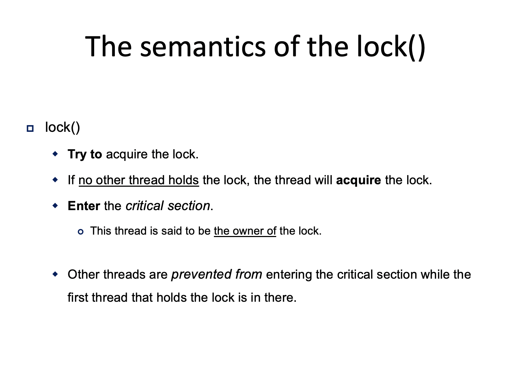
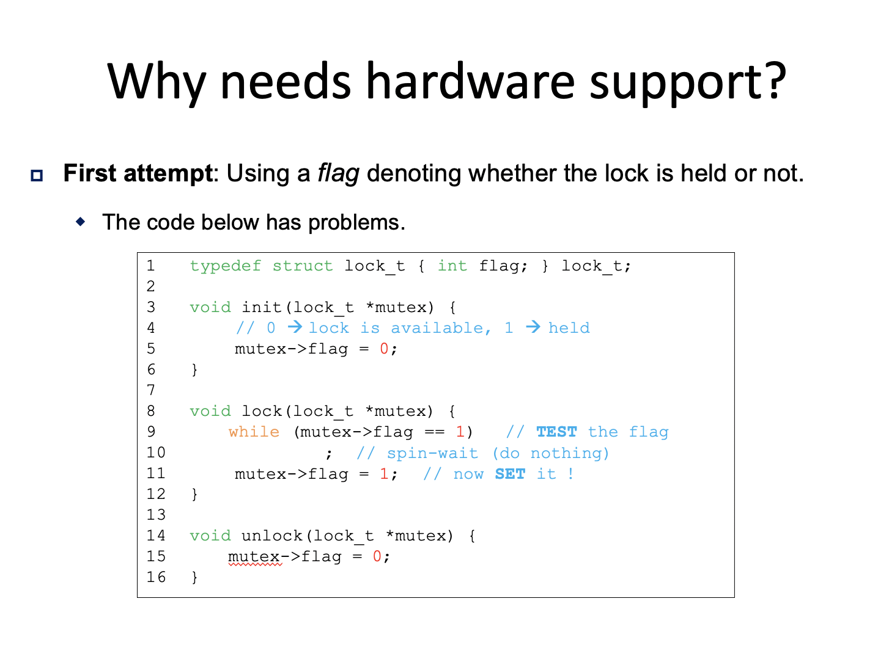
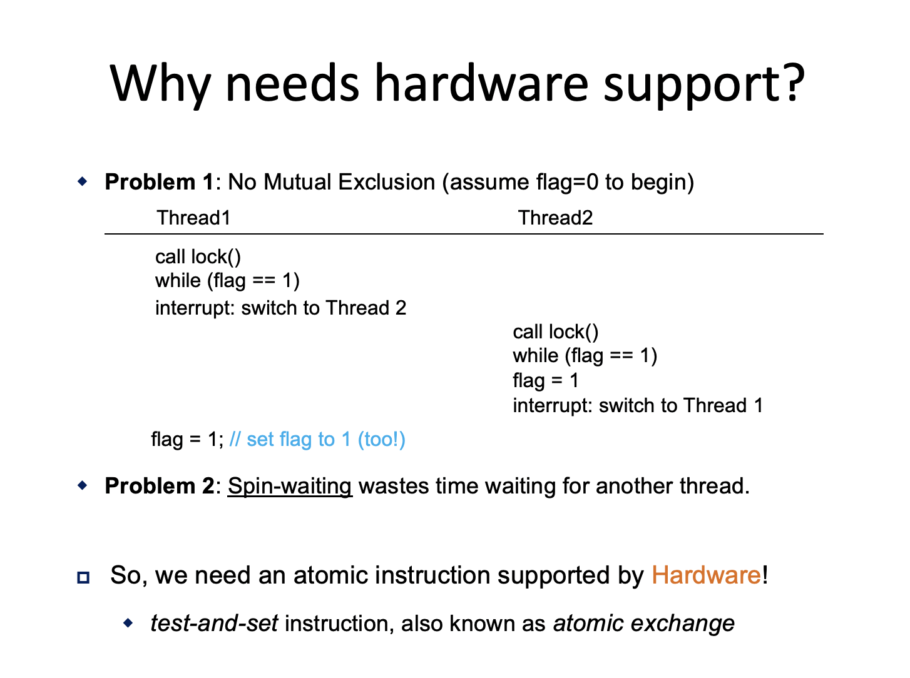
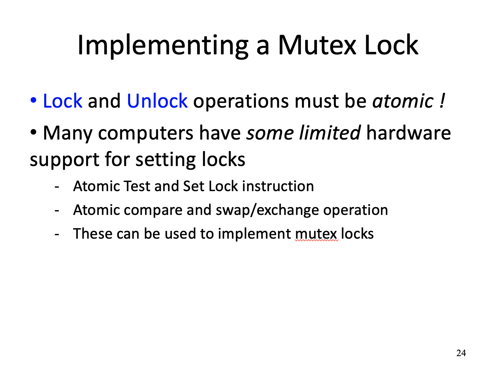
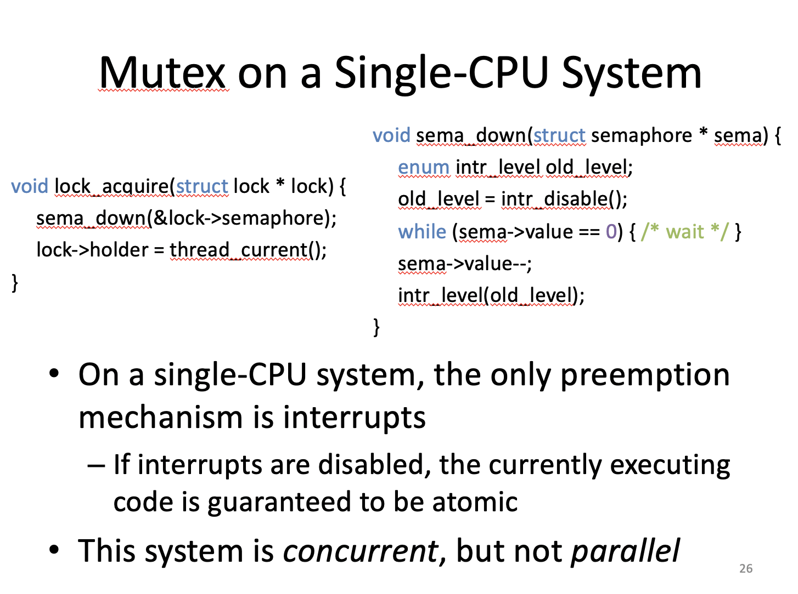
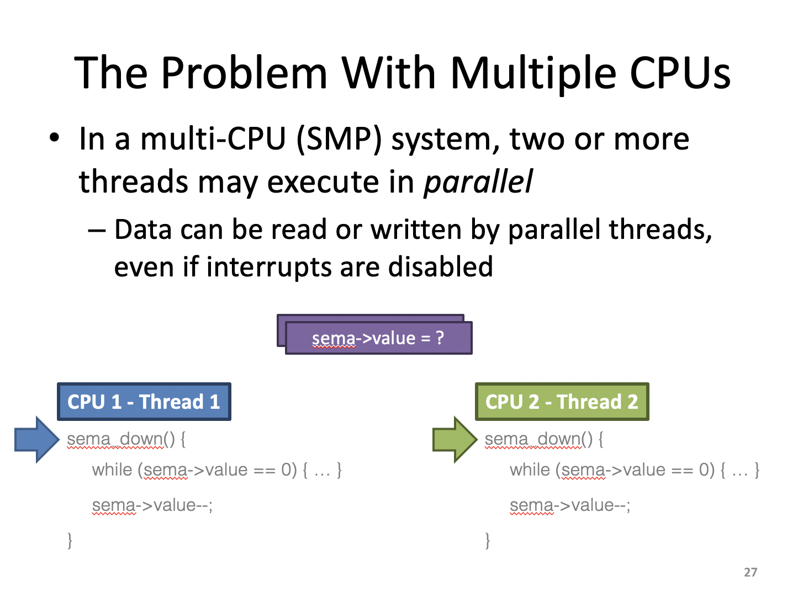
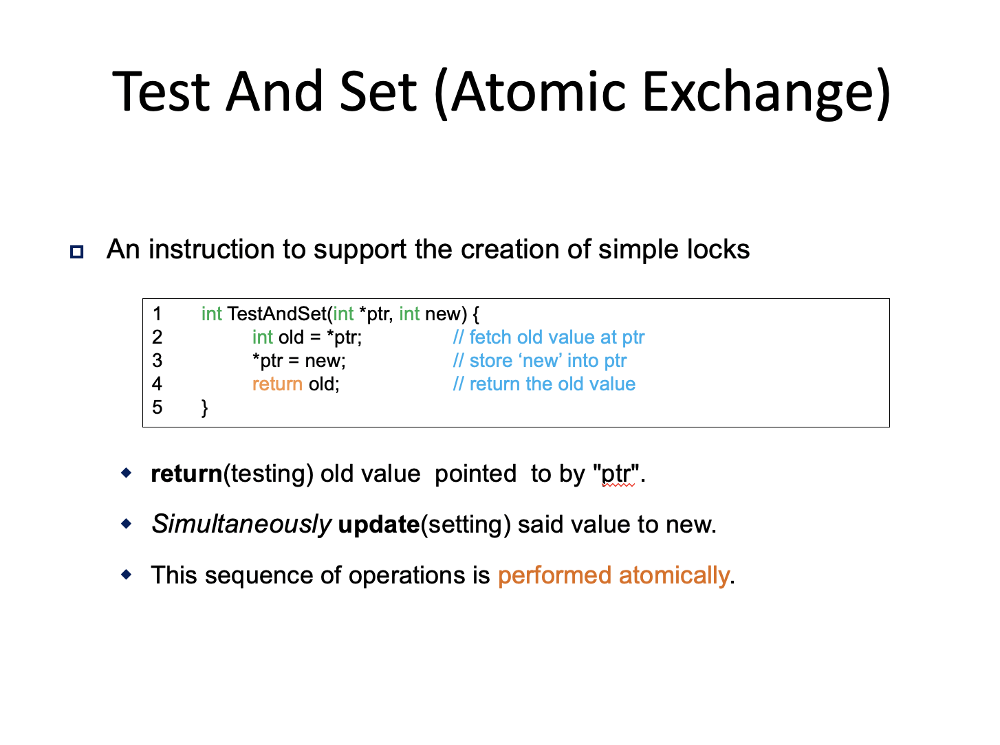
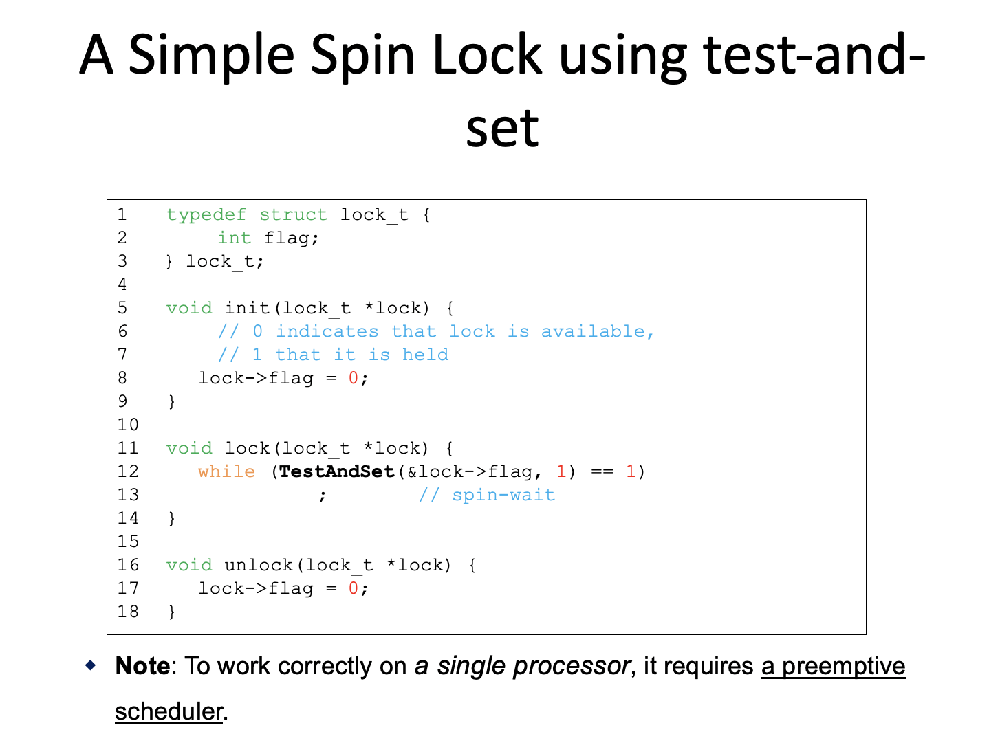
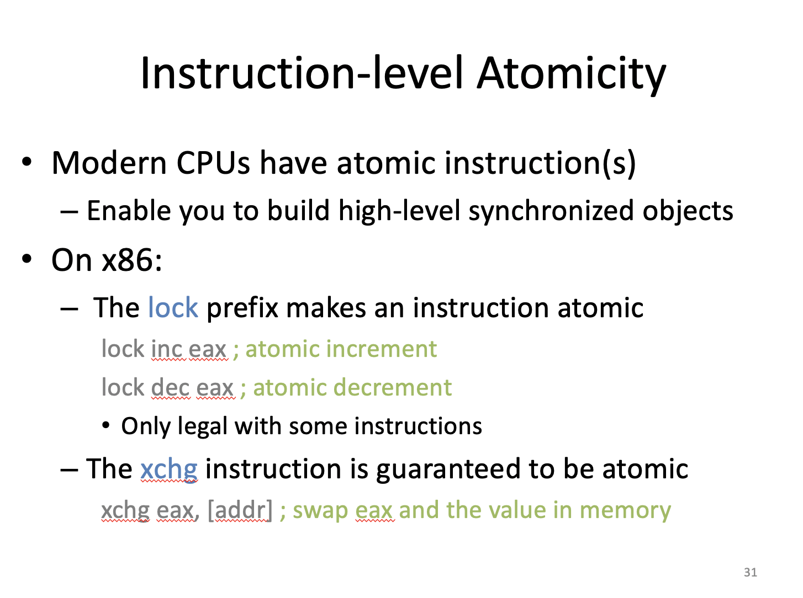
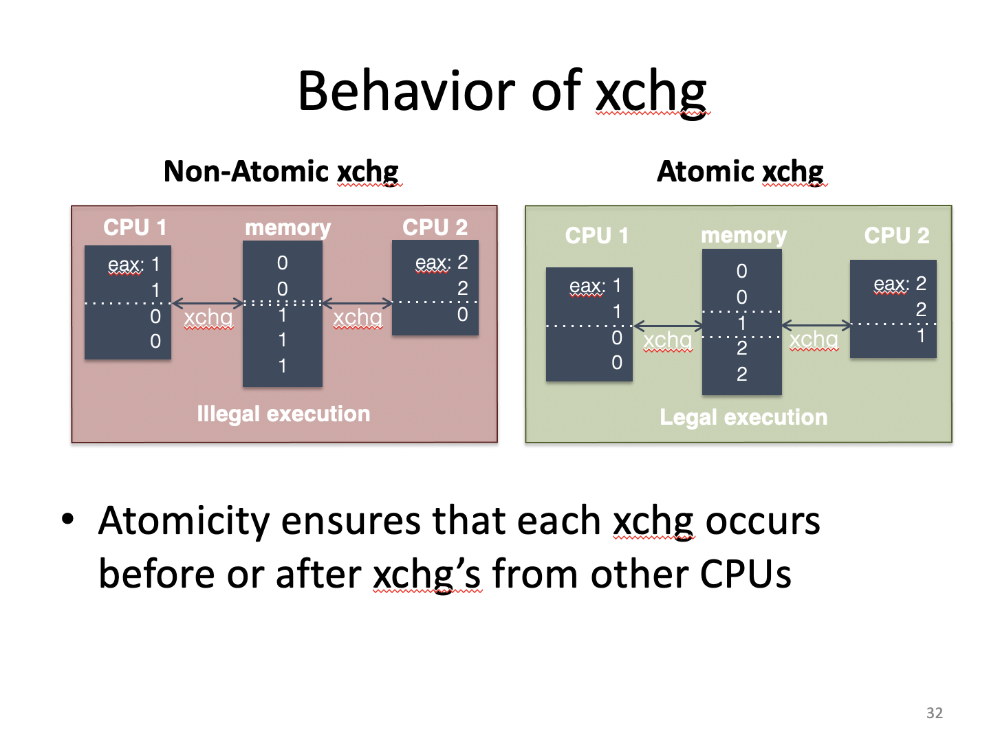

# Concurrency

 트랜지스터는 증가하지만 클락 스피드는 증가하지 않기 때문에 여러 개의 코어로 많은 태스크들을 동시에 수행시키게 됐다. 즉, 병렬성을 증가시키는 것이 중요해진다.

----

Concurrency(병행성)는 동시에 동작을 하는 것이기 때문에 코어가 하나여도 상관없다.

Parallelism(병렬성)은 실제로 한 순간에 정말로 여러 개가 동작해야 하기 때문에 CPU 또는 코어가 여러개가 필요하다.

----

병렬성은 두 가지를 생각해야 한다.

- Task parallelism : 서로 다른 태스크들이 각각 코어에서 돌아가는 것. ex) 비디오 게임의 경우 어떤 쓰레드는 AI를 돌리는데 사용하고 어떤 쓰레드는 또 다른 태스크를 하는 것

- Data parallelism : 태스크는 하난데 데이터를 여러 개 병렬로 돌리는 것. ex) 분산 시스템, 검색 엔진

----

암달의 법칙 : 병렬이 아닌 프로그램을 병렬화를 했을 때 어느 정도의 퍼포먼스를 수행할 수 있는가를 판단

S : sequential 파트가 몇 퍼센트냐. 병렬화 시킬 수 없는 부분이 몇 퍼센트냐

N : CPU의 갯수. 계산에 동원될 수 있는 자원의 개수

즉, CPU개수도 중요하지만 소프트웨어를 병렬화시키는게 중요하는 것을 말하는 것 

----

CPU의 갯수가 늘어난다고 해도 늘어난 만큼 비례하여 퍼포먼스 성능이 좋아지지 않는다는 것을 보여준다.

즉, 프로그램의 성능은 CPU의 갯수가 아니라 프로그램에서 sequential로 구현할 수 있는 부분에 달려있다.

----

----

----

두 사람이 동시에 계좌에 돈을 보내는 상황을 가정

----

Context Switching이 언제 일어나느냐에 따라 결과가 달라질 수 있다. <- 문제

----

Race Contidition은 어떤 자원에 대해서 서로서로 수행을 하려고 경쟁을 하는 것

문제는 어떤 결과가 나올지를 예측할 수 없다는 점이다. 

이 문제는 동시에 한 자원을 액세스하려고 하기 때문 즉, 병행성이 있기 때문이다. 

이를 해결하기 위해서는 병행성을 없애고 sequential하게 수행을 해야 한다(Race condition을 없애야함).

----

----

Crash를 방지하기 위해 Critical Section이라는 것을 정의한다.

공유자원에 대해서 경쟁 조건이 발생하게 되면 이를 방지하기 위해서 어떻게 해야 하느냐가 Critical Section Problem

Critical Section은 공유자원을 접근하는 코드의 영역인데 반드시 쓰레드가 하나만 동작해야하는 영역으로 정의한다. 다시 말해 sequential하게 액세스 해야 되는 영역을 뜻함

코드의 문제가 아닌 공유 자원을 어떻게 액세스하느냐가 중요한 문제다.

----

Atomicity(원자성)은 어떤 수행들을 섞이지 않도록 묶여서 수행할 수 있도록 만드는 것(오른쪽 그림)

이 방법은 병행성이 없어진다. 서로 수행하는 순서가 달라진다해도 나의 Operation 사이에 아무도 끼어들 수 없다.

Mutexes(상호 배제)를 만들어서 Atomicity를 이룸

----

----

Lock의 기본적인 아이디어는 Critical Section을 장소처럼 생각하는 것

장소에 들어가려면 Lock에 대한 접근권한을 가져서 Lock을 사용해 접근할 수 있는 개념

Lock과 unlock으로 둘러쌓여 있는 Critical Section에는 쓰레드가 하나만 들어가는 것을 보장해야 한다. 즉, lock과 unlock 사이에는 Intruction이 Atomic(중간에 끼어들지 않음)이다. 

----

Critical Section 안에 아무런 Instruction이 없다면 lock을 얻어 쓰레드가 들어갈 수 있다.

나머지 쓰레드들은 unlock될 때까지 기다려야 한다.

----

lock에 대한 Operation을 가지고 Critical Section을 만드려면 하드웨어의 지원이 있어야 한다. 

----

----

CPU 마다 하드웨어 마다 지원되는 Atomic Instruction이 다르다.

----

Lock을 구현할 때 필요한 조건

1. Mutual exclusion - 정확성, Critical Section에 반드시 하나만 들어가도록 보장해야한다.
2. Progress - 아무도 lock을 잡고 있지 않으면 누군가는 들어가야 한다. 다시 말해 Critical Section에 누군가 진입을 해야 한다. 
3. Bounded waiting - unlock을 했다면 다른 누군가가 들어갈 수 있어야 한다.

----

----

----

----

----

----

----

