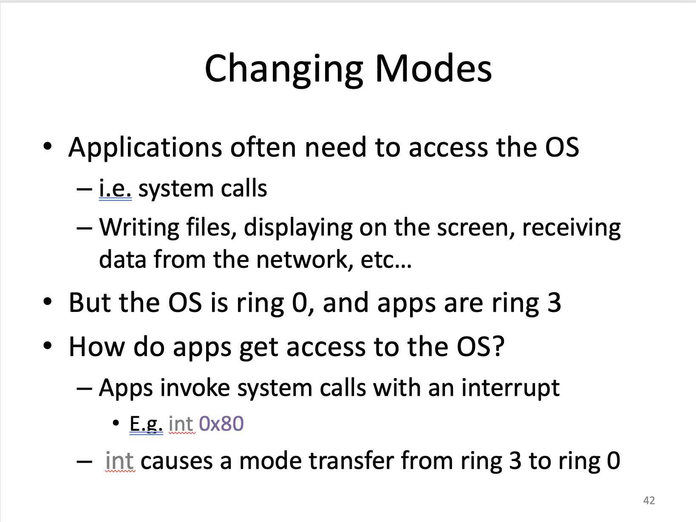
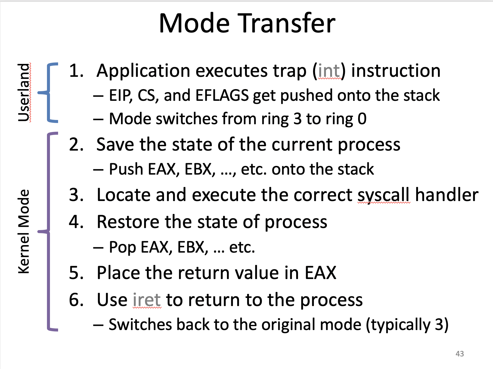
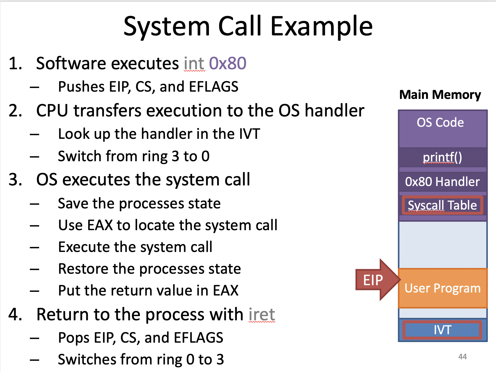

## Processes

운영체제의 가장 기본적인 기능 프로그램을 메모리에 load시켜 실행시키는 것

프로그램 : 수행시킬 수 있는 파일형태로 저장되어있는 것

프로세스 : 수행중인 프로그램. 메인메모리(RAM)에 저장

Loader : 프로그램을 메모리에 적재하는 것

Kernel : 프로그램의 생성에서부터 종료까지 프로세스를 관리하는 것, Kernel이 관리하는 것은 일반적으로 자료구조로 나타나는데 이를 Program Control Block(PCB)라고 부른다. 

------------

PCB

```c
struct task_struct { 						// Typical Unix PCB
  pid t_pid; 				 						// process identifier
  long state;				 						// state of the process	
  unsigned int time_slice; 			// scheduling information
  struct task_struct *parent; 	// this process's parent
  struct list_head children; 		// this process's children
  struct files_struct * files;  // list of open files
  struct mm_strcut *mm; 				// address space of this process
}
```

------------

Process States


모든 프로세스는 Parent Children 관계를 가진다. 예를 들어 1번 프로세스가 2번 프로세스를 실행했으면 1번 프로세스는 Parent 프로세스가 되고 2번 프로세스는 Children 프로세스가 된다.

프로세스가 종료가 될 때는 Children이 Parent보다 먼저 끝나야 된다. 만약에 Children이 먼저 끝나지 않는다면 해당 Children은 orphans(고아)라고 부른다.

Parent는 Children이 끝날때까지 wait() 함수를 호출해 기다려야 하는데 wait를 하지 않는다면 해당 Parent는 Zombie라고 부른다. 여기 wait함수를 호출하는 것의 의미는 단순히 children이 종료되기만을 기다리는 것 뿐만 아니라  Children 프로세스가 끝나면 운영체제에게 알려 사용했던 자원을 회수하고 자료구조도 없애는 작업을 요청하는 의미를 가진다.

---------

Process Tree


맨 위 root process는 parent가 없다. Unix에서는 이를 init process라고 부른다

Init process는 bootloader가 boot prodecure를 모두 끝마치게 되면 init process로 바뀌게 된다. 즉 처음부터 존재했던 root process가 된다. 

--------

<b>Additional Execution Context</b>

- File descriptors
  - stdin, stout, stderr
  - Files on disk
  - Sockets
  - pipes
- Permissions
  - User and group
  - Access to specific APIs
  - Memory protection
- Environment
  - $PATH
- Shared Resources
  - Locks
  - Mutexes
  - Shared Memory

----------

#### Process 관리의 예 : UNIX

UNIX Process Management

- fork() - 프로세스의 복제본을 만드는 시스템 호출 함수, 나 자신과 복제본 두 개의 값이 생긴다.
- exec() - 프로그램 파일이나 정보를 주면 읽어봐서 메모리에 적재하는 함수
- wait() - 프로세스가 끝났을 때 알려주는 함수

----------

 #### Context Switching(문맥 교환)

Context는 프로세스를 정지했다가 다시 복원해서 수행을 하려고 할 때 복원에 필요한 충분한 정보

 프로세스를 복원하려고 할 때 이전에 있던 프로세스의 정보를 다시 메모리로 가져와서 특정 시점부터 다시 수행하게끔 하는 충분한 정보를 Context라고 하고 그 두개를 바꾸는게 Context Switching

1. 그 프로세스의 상태를 어떻게 저장할 것인가
2. 현재 수행하고 있는 프로세스의 수행을 어떻게 중단할 것인가
3. 이전에 저장됐던 프로세스를 어떻게 복원할 것인가

이전에 수행했던 프로세스들을 올바르게 작동하게 만들기 위해서는 위 문제들을 해결해야한다.

--------

##### The Process Stack

 Stack에 저장되는 것들 : Local variables, Arguments to functions, Return addresses from functions 

 On x86 :  

- 스택이 아래로 늘어난다.

- Stack Top을 가리키는 포인터 = ESP(Stack Pointer register)
- Stack Base를 가리키는 포인터 = EBP(Base Pointer)
- Stack에 필요한 연산 : push, pop, call, ret, int, iret

-------

#### Stack Switching

현재 사용하고 있는 Stack을 바꿔주는 것

현재 Stack에는 프로세스가 사용하고 있는 Control flow가 저장되어 있는데 이 말은 이 프로세스가 현재 일련의 과정(함수 호출)을 거쳐서 여기까지 왔다는 것을 저장하고 있다는 말 따라서 Stack을 바꾸면 Control flow가 바뀐다.

-----

#### Switching between Processes

1. Process1이 Switch() 시스템 콜
2. CPU register(process 1) 값을 Stack에 저장
3. Stack Pointer가 메모리에 저장
4. Process 2의 stack pointer가 load
5. CPU register 복원
6. Switch() 가 process2를 return

---

#### When Do you Switch Processes?

Four approaches

1. Voluntary yielding
2. Switch during API calls to the OS
3. Switch on I/O
4. Switch based on a timer interrupt

**Voluntary yielding**

자기가 자발적으로 CPU에 대한 사용권을 포기하는 것 e.g.thread_yield()

문제점 

- 임의의 OS의 경우 프로그래머가 여러 명일 경우 버그나 오작동이 발생하게 되면 이 프로세스가 CPU를 자발적으로 포기하지 않을 경우(never yield)
- yield를 하긴 하지만 너무 많은 시간을 소요 하는 경우
- CPU 자원의 낭비,  i.e. 어떤 프로세스가 I/O를 요청해 놓고 yield를 하지 않으면 사용자의 입력이 들어오기 전까지는 CPU가 낭비될 수 있다.

**Switch during API calls to the OS**

프로세스가 시스템 호출을 하게 되면 프로그램 권한이 OS로 넘어오고 OS가 context switching을 할 수 있는 기회가 생기게 되는 것이다. 그렇기 떄문에 시스템 호출 내에서 context switching을 할 수 있게 되는 것

문제점

- 버그가 있는 함수나 프로그램이 존재한다면 OS API를 아예 안 부르는 경우가 있다. 이는 context switching을 못하게 되는 결과가 나온다.

**Switch on I/O**

어떤 프로세스가 I/O를 기다리고 있을 때 context switching이 일어나는 것

문제점

- 시스템 호출을 할 때와 같은 문제가 있을 수 있다. 즉 I/O를 하지 않는 경우에 문제가 생일 수 있다.

**Switch based on a timer interrupt**(=Preemptive Context Switching)

타이머를 사용해 인터럽트를 발생시켜 context switching을 일으켜 다른 프로세스를 수행하게끔 만드는 것

문제점

- 하드웨어적으로 programmable timer를 요구

----

#### Isolation

프로세스가 여러 개 동작할 때, 각 프로세스가 서로 간섭하지 못하도록 보장해주는 것 == Protection과 비슷

어떤 프로세스가 잘못된 행동(ex: 다른 프로세스 침범, 운영체제 침범 등)을 하지 못하게 하려면 어떻게 해야될 것인가?

- 인터프리터나 시뮬레이터를 사용해서 명령어가 들어올 때마다 컴파일을 해서 해당 명령어의 수행 유무를 판단해 프로그램을 수행시키는 것
- 가상 머신을 사용하는 것(ex: JAVA)

이런 접근 방식의 단점은 느리다는 것이다.

가장 빠른 방식은 CPU에서 바로 동작시키는 것일 것이다. 그렇기 때문에 명령어의 Level을 정해 프로세스마다 권한을 줘서 수행한다면 빠르게 수행할 수 있다.

현대의 x86 CPU의 경우 각각 다른 권한을 가진 4개의 Ring을 가지고 있다

- Ring0: OS kernel
- Ring1, Ring2: device drivers
- Ring3: userland

Ring0: 모든 하드웨어에 액세스 가능, 모든 명령어 사용 가능

Ring3: 유저모드. 제한된 기능, 원한다면 반드시 운영체제에 요청해야된다(==시스템 콜을 한다)

**Changing Modes**

OS API를 Ring3에서 어떻게 호출하느냐?  int 0x80이라는 소프트웨어 인터럽트를 사용해서 호출, int를 부르게 되면 Context Switching 발생



**Mode Transfer**



----

**System Call Example**



