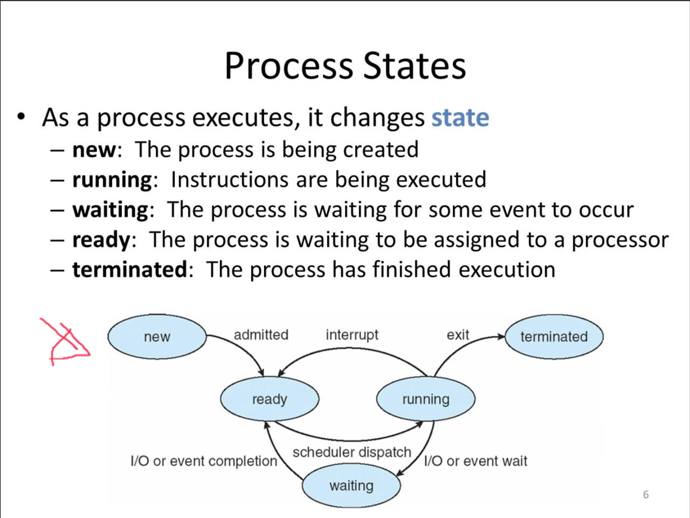
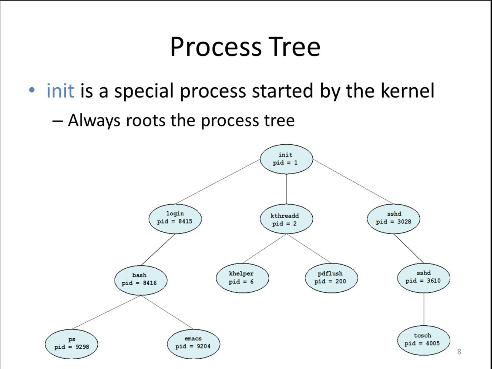

## Processes

운영체제의 가장 기본적인 기능 프로그램을 메모리에 load시켜 실행시키는 것

프로그램 : 수행시킬 수 있는 파일형태로 저장되어있는 것

프로세스 : 수행중인 프로그램. 메인메모리(RAM)에 저장

Loader : 프로그램을 메모리에 적재하는 것

Kernel : 프로그램의 생성에서부터 종료까지 프로세스를 관리하는 것, Kernel이 관리하는 것은 일반적으로 자료구조로 나타나는데 이를 Program Control Block(PCB)라고 부른다. 

PCB

```c
struct task_struct { 						// Typical Unix PCB
  pid t_pid; 				 						// process identifier
  long state;				 						// state of the process	
  unsigned int time_slice; 			// scheduling information
  struct task_struct *parent; 	// this process's parent
  struct list_head children; 		// this process's children
  struct files_struct * files;  // list of open files
  struct mm_strcut *mm; 				// address space of this process
}
```

Process States



모든 프로세스는 Parent Children 관계를 가진다. 예를 들어 1번 프로세스가 2번 프로세스를 실행했으면 1번 프로세스는 Parent 프로세스가 되고 2번 프로세스는 Children 프로세스가 된다.

프로세스가 종료가 될 때는 Children이 Parent보다 먼저 끝나야 된다. 만약에 Children이 먼저 끝나지 않는다면 해당 Children은 orphans(고아)라고 부른다.

Parent는 Children이 끝날때까지 wait() 함수를 호출해 기다려야 하는데 wait를 하지 않는다면 해당 Parent는 Zombie라고 부른다. 여기 wait함수를 호출하는 것의 의미는 단순히 children이 종료되기만을 기다리는 것 뿐만 아니라  Children 프로세스가 끝나면 운영체제에게 알려 사용했던 자원을 회수하고 자료구조도 없애는 작업을 요청하는 의미를 가진다.

Process Tree



맨 위 root process는 parent가 없다. Unix에서는 이를 init process라고 부른다

Init process는 bootloader가 boot prodecure를 모두 끝마치게 되면 init process로 바뀌게 된다. 즉 처음부터 존재했던 root process가 된다. 

<b>Additional Execution Context</b>

- File descriptors
  - stdin, stout, stderr
  - Files on disk
  - Sockets
  - pipes
- Permissions
  - User and group
  - Access to specific APIs
  - Memory protection
- Environment
  - $PATH
- Shared Resources
  - Locks
  - Mutexes
  - Shared Memory

#### Process 관리의 예 : UNIX

UNIX Process Management

- fork() - 프로세스의 복제본을 만드는 시스템 호출 함수, 나 자신과 복제본 두 개의 값이 생긴다.
- exec() - 프로그램 파일이나 정보를 주면 읽어봐서 메모리에 적재하는 함수
- wait() - 프로세스가 끝났을 때 알려주는 함수

 #### Context Switching

Context는 프로세스를 정지했다가 다시 복원해서 수행을 하려고 할 때 복원에 필요한 충분한 정보

 프로세스를 복원하려고 할 때 이전에 있던 프로세스의 정보를 다시 메모리로 가져와서 특정 시점부터 다시 수행하게끔 하는 충분한 정보를 Context라고 하고 그 두개를 바꾸는게 Context Switching

1. 그 프로세스의 상태를 어떻게 저장할 것인가
2. 현재 수행하고 있는 프로세스의 수행을 어떻게 중단할 것인가
3. 이전에 저장됐던 프로세스를 어떻게 복원할 것인가

이전에 수행했던 프로세스들을 올바르게 작동하게 만들기 위해서는 위 문제들을 해결해야한다.

##### The Process Stack

 Stack에 저장되는 것들 : Local variables, Arguments to functions, Return addresses from functions 

