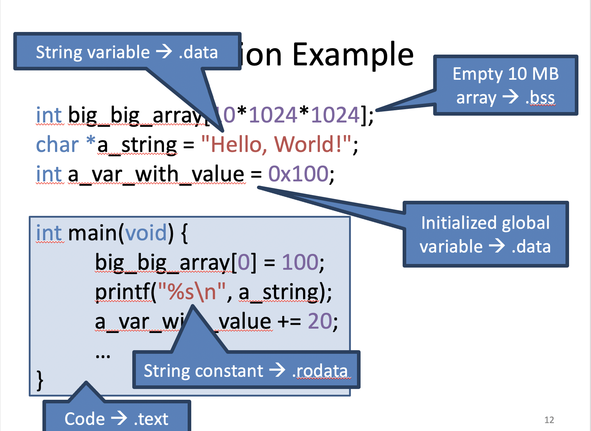

#### How to Run a Program?

.exe 파일을 더블 클릭할 때, OS는 어떻게 디스크에 있는 파일을 프로세스로 만들까?

프로그램으로써 동작하기 위해서 .exe 파일이 반드시 포함해야되는 정보는 무엇인가?

위의 물음을 알아보도록 하자.


프로그램들은 운영체제에 따라 특정한 포맷을 가지고 있어야 한다. 그 중 ELF 포맷(실습과도 관련)에 대해 자세히 알아볼 예정

----

test.c

```c
#include <stdio.h>

int big_big_array[10*1024*1024]; // integer가 4byte이기 때문에 10*1K*1K 는 40M의 배열 선언
char *a_string = "Hello, World!";  
int a_var_with_value = 100;

int main(void) {
  big_big_array[0] = 100; 
  printf("$s\n", a_string);
  a_var_with_value += 20;
  
  printf("main is: %p\n", &main);
  return 0;
}
```

----


ELF Header는 Entry Point와 프로그램 헤더, 섹션 헤더의 위치를 가진다. Entry Point라는 것은 코드의 시작점을 나타낸다.

Program header table은 파일에 대한 세그먼트 정보를 가지고 있다. 세그먼트란 인텔 CPU에서 로지컬한 어드레스의 집합을 얘기한다. 쉽게 얘기해 어떤 데이터나 코드의 로지컬한 집합을 뜻한다. 프로그램을 로드할 때는 프로그램 헤더 테이블이 중요하다.

Section header tabel은 링커에 의해 사용. 각각의 섹션은 섹션 헤더 테이블에 대한 정보가 있고 각 섹션에 대한 링크를 할 때 섹션 헤더 테이블을 사용한다.

----

#### Sections and Segments


Sections: 위의 이미지 중에서 .text .rodata .data 처럼 구분한 것이 Section이다. 

Segments: 이러한 Section들의 집합

----

#### Common Sections


여기서 rodata는 Read-Only-Data로 예를 들어 상수를 뜻한다.

.bss는 0으로 초기화된 글로벌 변수를 말한다. 그렇기에 .bss가 크면 해당 영역을 0으로 만드는 시간이 오래 걸리기 때문에 로딩이 오래 걸린다.

----

#### Section Example



----


----


----

#### Segments

하나 이상의 섹션들의 로지컬한 집합. 즉, 연관된 항목들끼리의 모임


----

#### Single-Process Address Space


프로그램에 저장되는 부분은 .rodata, .data, .text 세 부분이 저장이 된다. 

.bss는 정보만 있고 만들어지지 않는 부분이고 stack과 heap은 나중에 프로세스가 만들어질때만 있게 된다.

----

