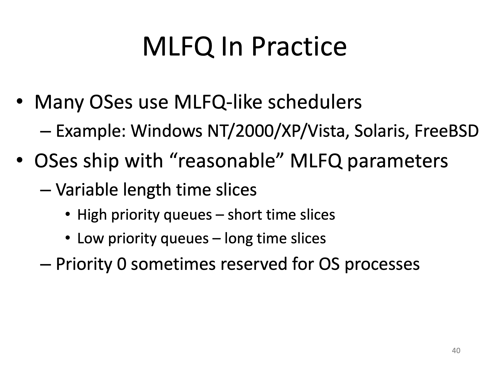

#### Setting the Stage

N개의 CPU가 있고, P개의 프로세스/쓰레드가 있다고 가정

그렇다면 우리는 

- 프로세스를 어떤 순서로 스케줄링해야 되는가?
- 각 프로세스를 실행할 CPU를 무엇인가?

를 결정해야 한다.

----

#### Factors influencing Scheduling

- 프로세스의 특성
  - CPU 중심 작업인가 I/O 중심 작업인가?
  - 프로세스가 제약조건을 가지고 있는가?
  - 프로세스가 예측가능한가?
- 머신(하드웨어와 운영체제)의 특성
  - CPU의 개수가 몇개인가?
  - 운영체제가 선점을 허용하는가?
  - CPU에 의해 메모리가 공유가 어떻게 이루어지는가?
- 사용자의 특성
  - 상호작용이 일어나는 프로세스인가?
  - 프로세스가 백그라운드 작업인가 포어그라운드 작업인가?

----

스케줄러는 크게 스케줄러와 디스패쳐로 생각할 수 있다. 

스케줄러는 어떤 프로세스를 선택할 것인가 하는 정책(policy)가 있는데 그 policy를 말하는게 스케줄러다. 즉, 레디 큐의 어떤 프로세스를 선택하는가를 정하는 것이 스케줄러고 선택된 프로세스를 CPU에 올려 수행을 해주는 것을 디스패쳐라고 한다.

----

디스패처는 수행된 정책에 따라 프로세스를 CPU에 올려주는 일을 한다. 디스패처의 가장 중요한 작업은 Context Switching을 해주는 것이다.

Context Switching : 사용자의 Context를 저장 => 유저모드에서 커널모드로 변환 =>  다음 수행할 프로세스의 Context를 복원 => 커널모드에서 유저모드로 변환

Context Switching overhead가 많으면 성능 상의 문제가 있을 수 있다. 그렇기에 이를 줄이게 된다면 퍼포먼스가 높은 운영체제라고 할 수 있다. 

----

----

CPU Burst가 일어나는 이유 : 어떤 프로세스가 CPU를 간헐적으로 사용하다가 폭발적으로 사용하게 되면 발생

----

#### Scheduling Optimization Creteria

----

#### Classic Scheduler(교재 4)

#### Turnaround Time 중시 => Completion(완료 시간) - arrival(도착 시간)

- First Come, First Serve(FCFS) 
  - 먼저 온 것을 먼저 서비스 해준다.
  - FIFO 큐에 프로세스가 저장된다.

정책이 바뀐 것이 아닌 단지 도착 순서만 바뀌었을 뿐인데 turnaround time이 눈에 띄게 짧아진 것을 확인할 수 있다. 이는 좋은 정책이라고 말할 수 없다.

- Shortest Job First(SJF)
  - 작업 길이가 짧은 것을 우선적으로 처리하는 정책

하지만 Arrival time이 다를 경우 Preempt를 시키지 않으면 FCFS와 같은 결과를 낳게 된다.

그래서 나온 것이 

- Shortest Time-To-Completion First(STCF)
  - 최소 잔여시간 우선 정책 == 선점형 최단 작업 우선(PSJF)

----

#### Response Time 중시 => First run time(처음 스케쥴된 시간) - arrival time(도착 시간) 

- Round Robin(RR)
  - Time slice(a.k.a. scheduling quantum)에 따라 시간을 쪼개 돌아가면서 프로세스를 수행하는 것  => 공정성 높음, 응답시간 빠름
  - 기본적으로 CPU가 타이머를 제공해야 하고 타이머 인터럽트가 발생할 때마다 스케줄러가 동작해야 한다.

----

#### RR vs STCF

----

#### Time Slice를 어떻게 설정해야 되는가

- Time slice를 얼마로 설정하느냐에 따라 응답 시간이 달라 지고 Context Switching도 달라진다.
- Time slice가 짧을수록 응답시간 기준 RR의 성능은 좋아지지만, Context Switching이 너무 많이 일어나게 돼 전체 성능에 영향을 줄 수 있다.
- 컴퓨터나 CPU의 성능이 좋아지면 좋아질수록 Time Slice가 빨라지는 경향이 있다. 

----

#### Priority Scheduling

지금껏 우리가 배웠던 Classic Scheduler 들도 모두 우선순위 스케줄러다.

우선 순위 스케줄러의 고질적인 문제점은 Starvation(CPU를 할당 받지 못하는 것)이다. 그렇기에 우선 순위 스케줄러는 Starvation 문제가 발생하지 않도록 하는 것이 중요

이를 해결하기 위해 우선순위를 동적으로 변화를 시켜야 한다. 어떻게 변화시키는가는 스케줄러의 알고리즘에 따라 변화시킨다.

----

#### Simple Priority Scheduler

----

#### Earliest Deadling First (EDF)

프로세스들이 데드라인이 있을 때, 그 데드라인을 만족시키기 위한 스케줄링

데드라인이 가장 가까운 프로세스부터 수행한다.

그렇기 때문에 EDF 알고리즘을 수행하려면 만드시 Preempt 스케줄링을 해야 한다는 것을 알 수 있다.

EDF 스케줄링 알고리즘는 Optimal이다 즉, 만약 EDF로 스케줄이 안되면 다른 어떤 스케줄러로도 데드라인을 다 만족시키도록 스케줄링할 수 없다.

EDF 스케줄링은 데드라인을 꼭 알아야하는 조건이 있다.

----

#### Multilevel Queue (MLQ)

멀티 레벨 큐는 우선 순위가 높은 큐와 낮은 큐로 나눠서 수행하는 것

사용자와 인터랙티브한 관계를 이루는 프로세스의 경우 우선순위를 높게 주고, CPU를 오랫동안 사용하는 프로세스의 경우는 우선 순위를 낮게 잡을 수 있다.

CPU 시간을 나누는 것으로 우선순위 구성할 수 있는데 어떻게 CPU 시간을 나눌것인가는 Fairness(공정성)의 문제를 생각해야 한다.

----

#### Problems with MLQ

위의 예와 더불어 MLQ의 문제는 어떤 작업이 인터랙티브한 작업이고 어떤 작업이 CPU 작업인지 안다고 가정하고 있다는 것이다. 실제로는 어떤 작업인지 알 방도가 없고 사용자가 알려주다고 하더라고 이게 맞다는 보증이 없다. 그래서 어떤 작업을 우선순위를 높게 주고 어떤 작업의 우선순위를 낮게 줄지 확실하게 정할 수가 없는 문제점이 있다.

또한 어떤 작업인지 안다고 해도 이 작업이 나중에 다른 작업으로 바뀔 수가 있다. 또는 두 개가 섞여있는 작업이 한 프로세스가 될 수 있다.

----

#### Mulilevel Feedback Queue (MLFQ)

우선 순위를 사용하면서 위와 같은 문제들을 해결하기 위해 나온 것이 MLFQ다.

MLFQ의 목적은 동적으로 프로세스를 수행함에 있어 우선 순위를 변화시켜 response time과 turnaround time 모두를 줄이는 것이다. 

MLFQ는 가정을 하지 않고 모두 다 모른다고 생각하고 수행

----

#### First 4 Rules of MLFQ

Rule 1: 우선 순위가 높다면 높은 프로세스부터 수행

Rule 2: 만약의 우선 순위가 같다면 즉, 같은 큐에 있다면 RR로 동작한다.

Rule 3: 프로세스가 처음 시작할 때 가장 높은 우선 순위에서 시작한다.

Rule 4: 

- Rule 4a : RR을 사용할 때 타임 슬라이스를 정할 때 해당 큐에 타임 슬라이스를 다 썼으면 우선 순위를 낮춘다. 왜냐하면 해당 큐에 존재하는 RR의 타임 슬라이스가 모두 다를 수가 있기 때문이다.
- Rule 4b: 인터랙티브 프로세스를 위한 것인데 만약에 타임 슬라이스를 다 쓰기 전에 종료(수행 시간이 아주 짧은 프로세스)를 하면 더 이상 우선 순위가 내려가지 않고 현재 있는 큐에서 유지된다.

----

#### Problem of MLFQ

첫 번째, Starvation 문제가 있을 수 있다. 만약 Q2의 프로세스가 작업을 수행 중에 우선 순위가 높은 프로세스가 계속 해서 들어오면 Q2의 프로세스는 CPU를 오랫동안 할당받지 못하게 되고 이는 Starvation의 문제로 이어지게 된다.

두 번째, Cheating 문제가 있을 수 있다. 이 문제는 Rule 4b에서 타임 슬라이스를 다 사용하지 않고 종료를 하면 우선 순위가 유지되기 때문에 타임 슬라이스가 끝나기 직전에 종료를 하고 해당 큐의 우선 순위를 유지하면 계속 수행할 수 있다는 이점이 있다.

----

#### MLFQ Rule 5: Priority Boost

위와 같은 문제를 해결하기 위해 새로운 Rule을 추가하게 된다.

Starvation을 해결하기 위해 Priority Boost(우선 순위를 높혀주는 것) Rule이 나왔다.

S라는 주기를 정하고 특정 시간이 지나고 나면 모든 프로세스를 제일 높은 우선 순위로 올리는 것을 말한다. 제일 높은 우선 순위로 모든 프로세스를 올리는 것은 다시 말해 초기화한다는 것을 의미한다.

----

#### Revised Rule 4 : Cheat Prevention

현재 큐(같은 우선순위)에서 CPU를 얼마나 사용했느냐를 계산을 해서 일정 수준이 넘어가게 되면 우선 순위를 낮춰주는 것으로 Rule4를 변경

----

#### MLFQ Rule Review

----

#### Parameterizing MLFQ

----

MLFQ는 조정을 해서 밸런싱이 가능하기 때문에 상용 OS에서도 많이 사용되고 있다.

많은 경우 운영체제의 프로세스들에게 가장 높은 우선순위(ex: 타이머 인터럽트)를 가지도록 보통 설계가 되어있다.

----

#### Giving Advice

위 처럼  사용자가 OS들에게 Advice를 줄 수 있도록 하는 OS들도 있다.

