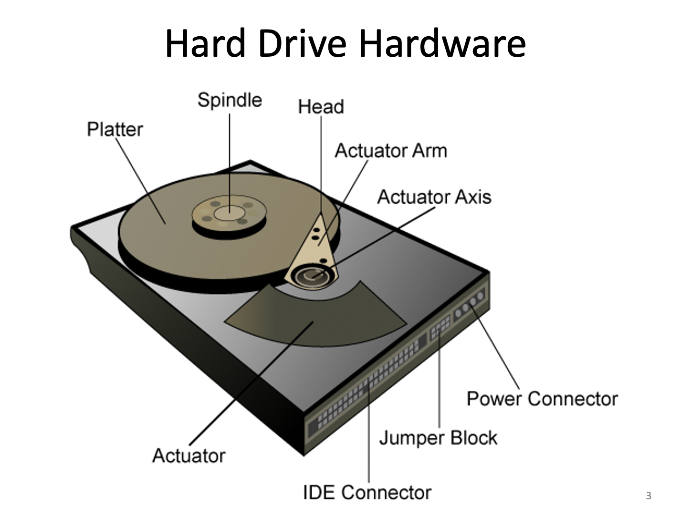
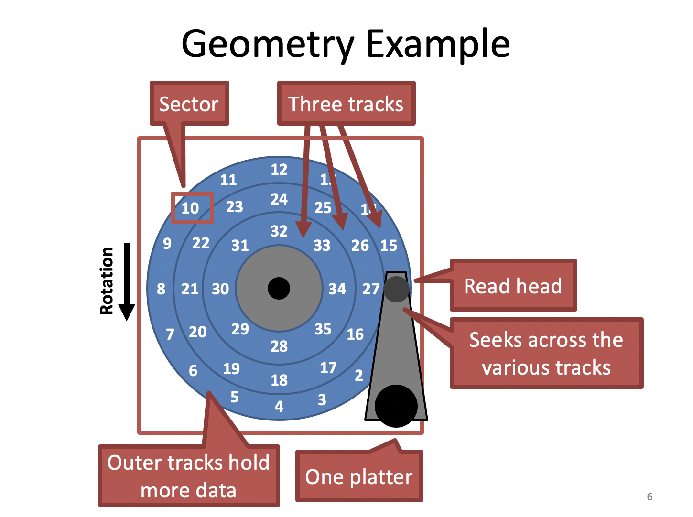
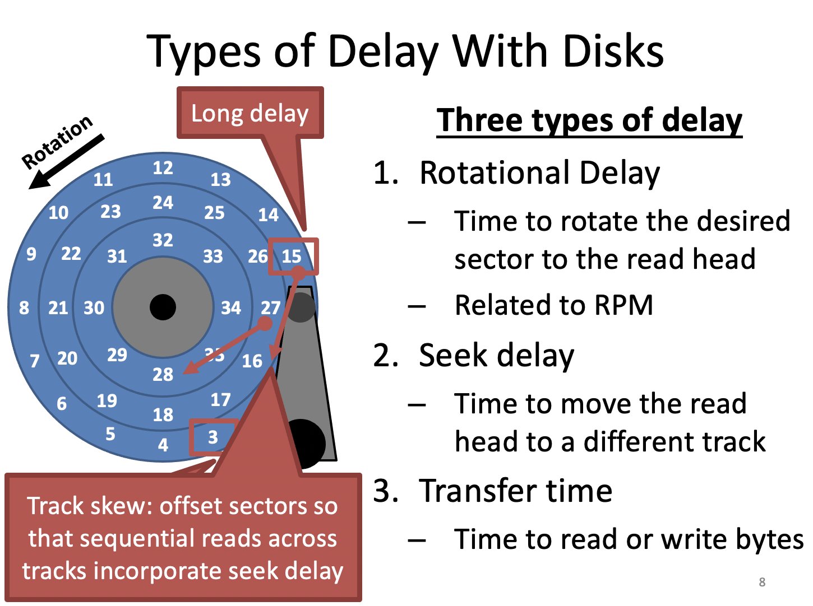

- 하드디스크는 섹터로 이루어진다. 

- 보통 한 섹터는 512byte 또는 4KB이다. 
- 멀티쓰레드를 할 때 Write가 Atomic이냐 아니냐하는 문제가 있는데 Sector에 대한 write는 atomic이다. 한 섹터를 쓸 때 두 개의 쓰레드가 동시에 쓰인다고 해도 하나가 먼저 쓰이고 그 다음은 다른 쓰레드가 쓰이게 된다.
- 섹터들을 합쳐서 트랙, 트랙을 입체적으로 봤을 때 실린더, 트랙은 플래터에 있고 플래터에는 두 개의 서피스가 있다.
- 플래터가 일정한 속도로 회전하게 되는데 이를 RPM(분 당 회전)으로 나타낸다.

ST-506 - 1980년대, 씨게이트, 5mb, 1400달러, IBM의 XT에서 사용, 컨트롤러를 따로 둬야함

ATA - IBM의 AT에서 사용, 컨트롤러가 디스크와 분리

IDE - ATA와 거의 유사, 컨트롤러가 디스크와 붙어있음

SATA - Serial ATA

SCSI - 주로 서버용, 패킷 단위로 데이터 송수신

디스크를 액세스할 때 걸리는 시간

1. Rotational Delay - 디스크가 회전하기 때문에 내가 원하는 섹터가 위치할 때까지 기다려야 하는 시간, RPM과 관련, 같은 트랙이라면 현재 위치에 섹터가 어디에 위치했는지에 따라 Delay가 결정
2. Seek Delay - 헤드가 내가 원하는 섹터가 있는 트랙으로 위치하는데 걸리는 시간
3. Transfer time - 위치를 찾은 후 섹터에서 읽어들이는 시간

1,2는 기계가 돌아가는 시간이기에 느리다. 3은 굉장히 짧다.

I/O Rate - 초당 I/O 율

캐시를 써서 속도 향상

- Read caching - Locality가 있다고 하면 Read Delay를 줄일 수 있음
- Write caching - Write back은 캐시에만 쓰고 디스크에는 사용하지 않고 Write through는 캐시와 디스크에서 모두 사용, 메인 메모리의 경우 Write back 사용, 디스크의 경우 Write through 사용하는게 안전한 방법
- Flash memory에서는 Write back을 사용 가능하다. 

랜덤 액세스를 사용하면 Locality가 없으므로 캐시가 아무 소용이 없다. 

디스크에 대한 요청들을 모아 미캐니컬 파트가 움직이는 걸 최소화 하는 것으로 스케줄링 하면 디스크의 속도를 높히는데 도움을 줄 수 있겠단느 아이디어가 Disk Scheduling

Disk Scheduling의 핵심을 미캐니컬 파트가 움직이는 시간을 줄이는 것 

미캐니컬 파트가 움직이는 시간은 섹터의 위치에 따라 다르다. 섹터가 멀리 떨어져 있으면 멀리 움직이고 가까이 있으면 조금 움직인다.

"들어온 순서대로 한다."

"Seek time이 가장 작은 것부터 한다." 

arm이 현재 위치에서 가장 조금만 이동하는 것부터 한다.

최적화된 방법이지만 starvation 문제가 있다.

SCAN - 한 쪽 방향으로 움직이고 끝에 도달하면 반대 방향으로 움직이는 것

퍼포먼스가 합리적이고 starvation이 방지된다. 하지만 average access time이 좋지 않고 양 끝에 있는   요청들은 access time이 오래 걸릴 수가 있다.

위 문제를 개선한게 C-SCAN - 한 쪽 방향으로만 서비스를 하는 것

SCAN 보다는 공평하지만 움직이는 길이가 길어 퍼포먼스가 떨어지게 된다.

C-SCAN과 똑같지만 끝까지 진행하지 않고 요청의 양 끝 사이에서만 움직이는 것

디스크 스케줄링을 어디서 구현할 것인가?

OS에서 하는 경우 

- SSTF 또는 SCAN, LOOK 등을 구현 할 수 있지만 OS가 현재 헤드 위치를 모른다.

디스크에서 하는 경우

- 대부분의 경우
- 디스크에 컨트롤러가 있고 컨트롤러 안에는 CPU와 메모리가 있고 소프트웨어가 위치한다.
- 컨트롤러가 현재의 헤드 위치와 로테이션 상태를 보고 스케줄을 할 수 있다.
- SPTF 스케줄링

이렇게 하기 위해서는 하드디스크에 특별한 하드웨어가 있고 그것을 지원하기 위한 OS의 드라이버가 있어야 한다.

SATA 디바이스의 경우 read/write 요청이 오면 큐에 가지고 있으면서 네이티브 커맨트 큐인 NCQ를 실행한다.

