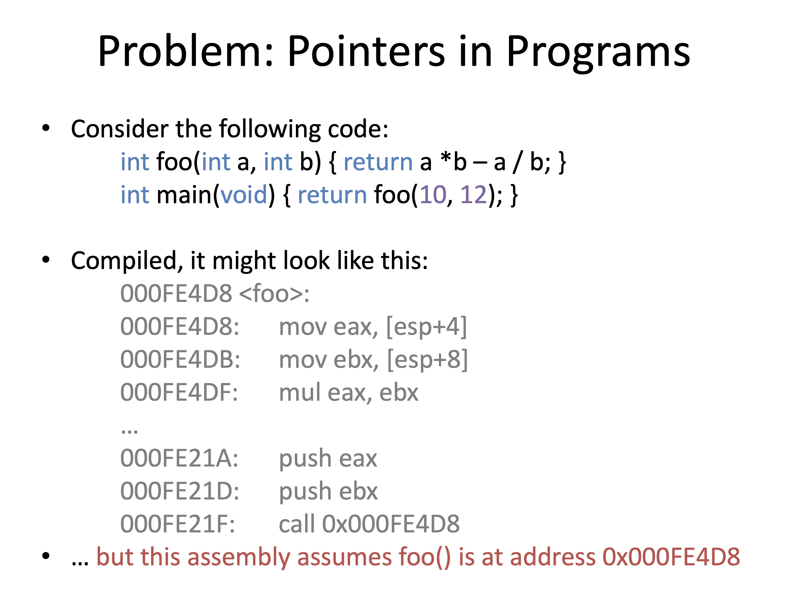
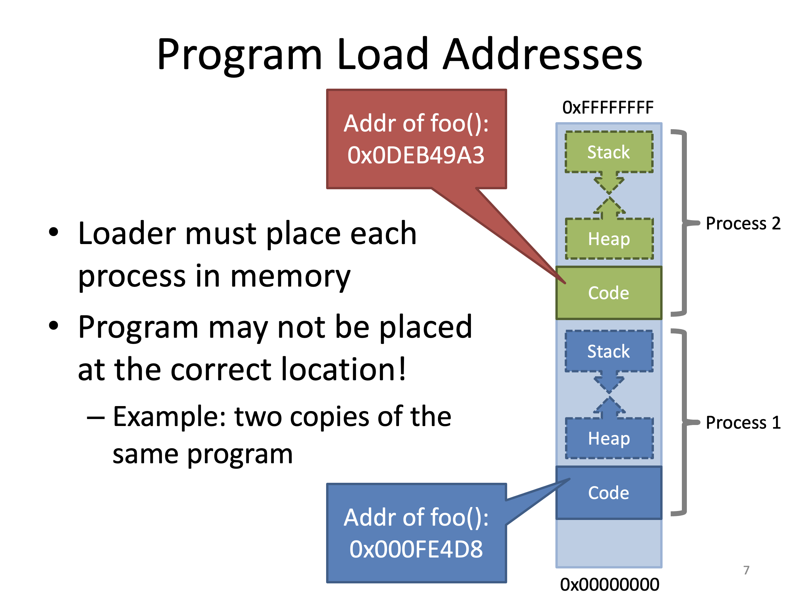
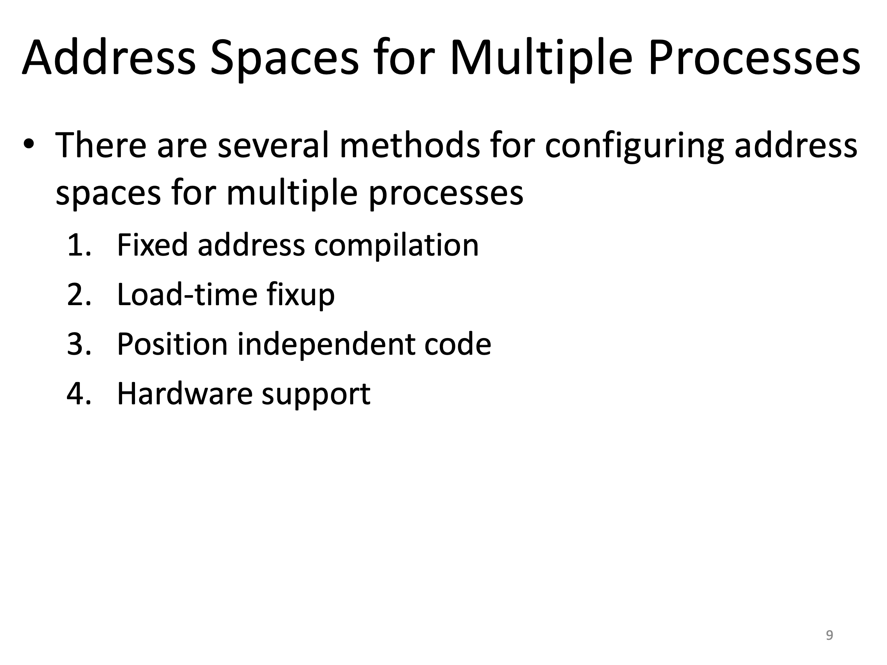
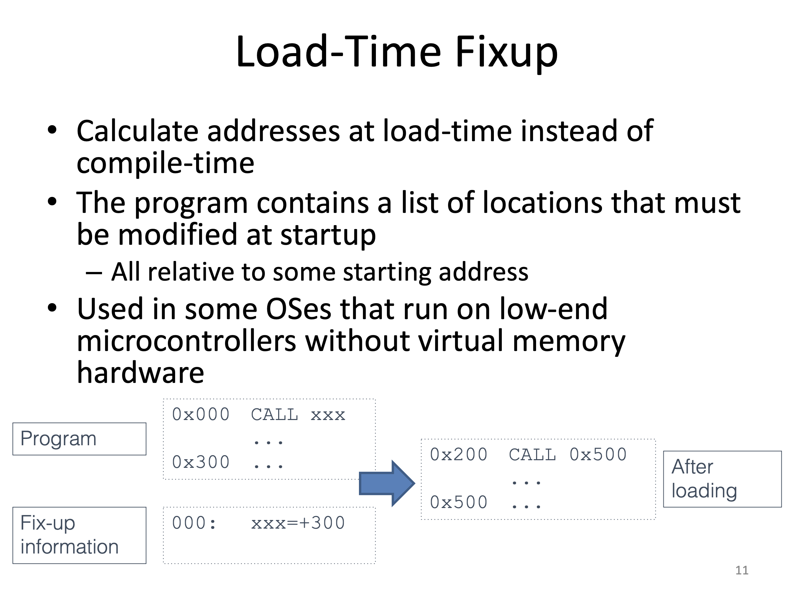
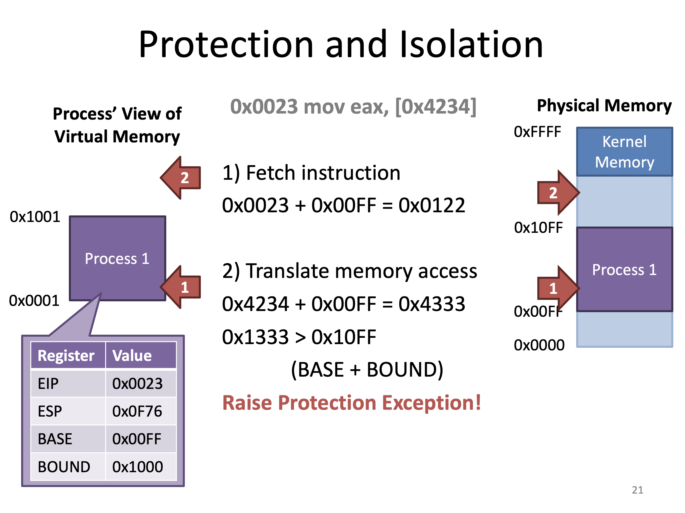
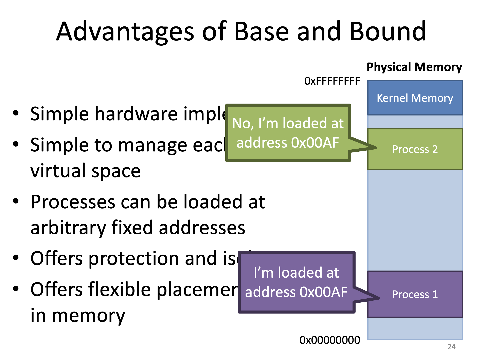
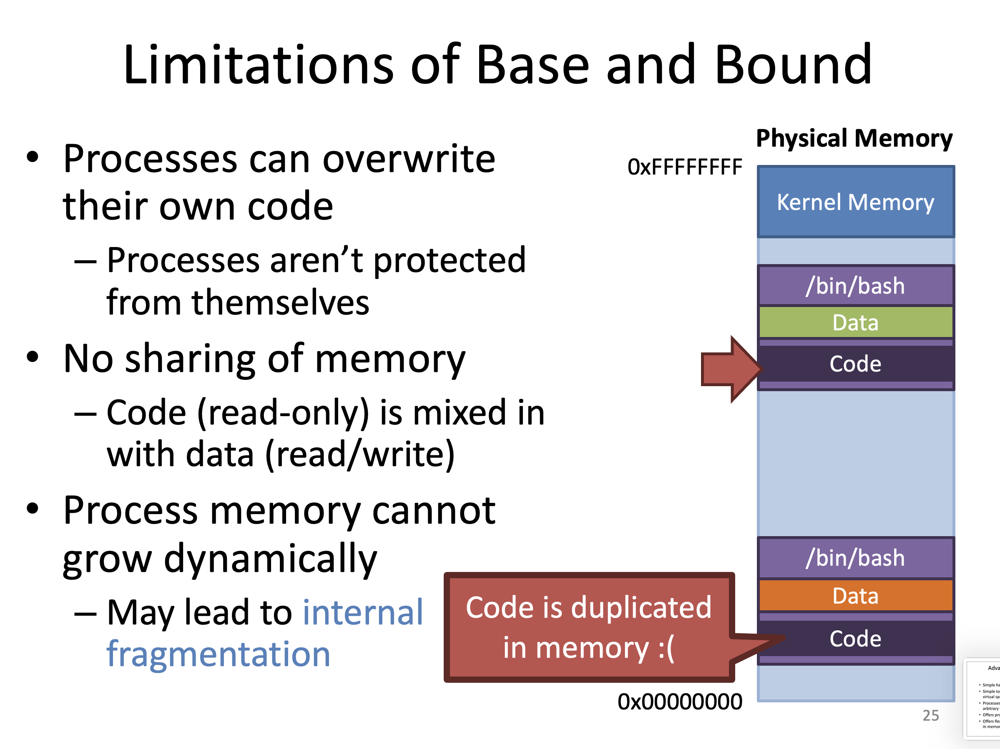
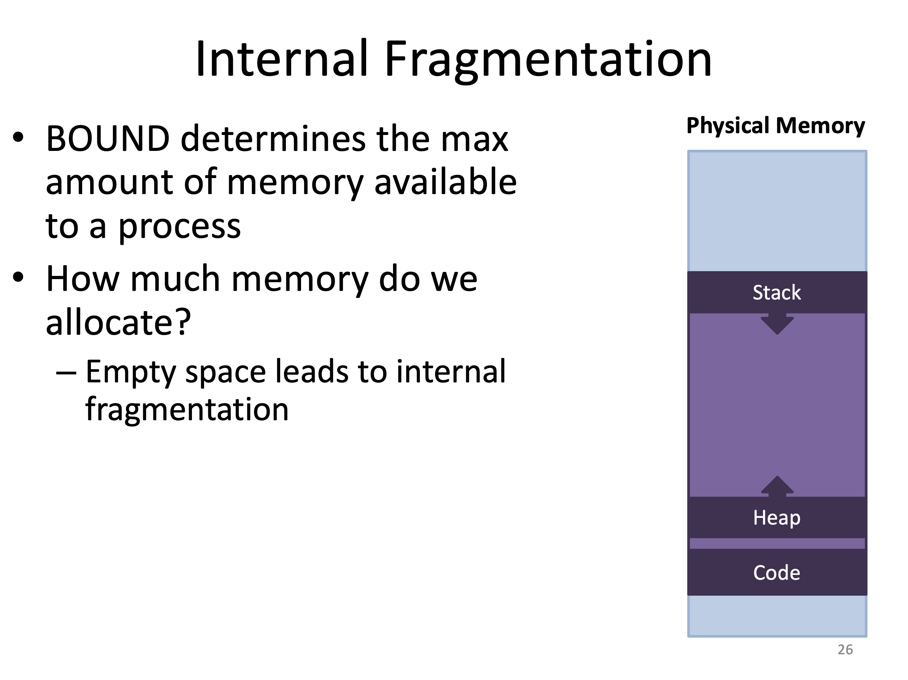
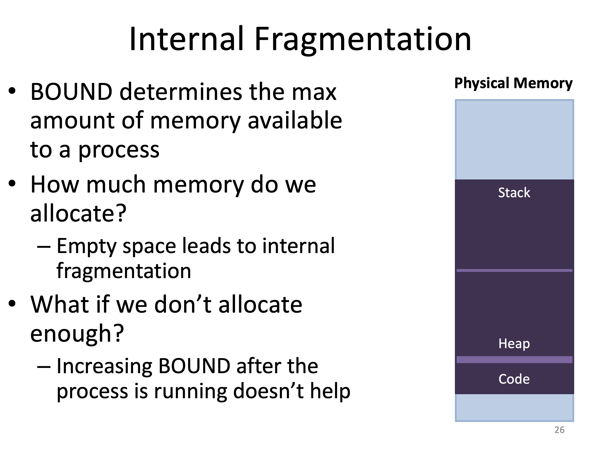
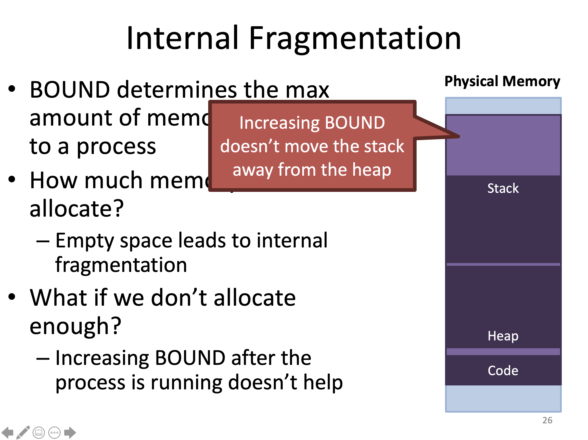

#### Physical vs Virtual Memory

 

Physical Memory만 사용하면 즉, DRAM만 사용하면 

1. 프로세스 간의 Protection, Isolation이 제공되지 않는다.
2. 포인터의 주소가 고정이 된다
3. 제한된 크기
4. 기타 등

와 같은 문제가 일어날 수 있다.

Virtual Memory를 이용해서 위와 같은 문제들을 해결할 수 있다.

----

#### Protection and Isolation

예를 들어 같은 주소 공간에 있다면 악의적인 프로세스가 다른 프로세스에 접근하는 것을 막을 방법이 없다.

또한 커널 메모리에 대해서도 같은 주소 공간에 있으므로 overwrite가 가능하기 때문에 시스템의 안정화에 문제가 있을 수 있고 부팅에 문제가 있을 수 있다. 

----

#### Problem: Pointers in Programs

이 문제는 프로세스가 하나일 때는 문제가 없는데 프로세스가 여러 개일 때 문제가 생길 수 있다.

포인터의 위치가 고정되기 때문에 Process2에서 foo 함수를 호출하더라도 Process1의 foo 함수에 접근하게 된다. 이는 곧 Protection이 안된다는 뜻

----

메모리가 꽉 찬 경우 새로운 프로세스가 도착했을 때 어떤 프로세스가 종료되기 전에는 수행시킬 수가 없게 된다.

----

Physical Memory를 사용할 때의 문제는 프로세스가 여러 개일 때 발생한다.

프로세스들의 함수나 데이터는 포인터에 의존하는데 프로세스가 여러 개 동작하게 되면 컴파일 했을 때 위치가 달라진다는 문제가 있다.

----

여러 프로세스를 동시에 수행시키려 할 때 어떻게 해결할 수 있을까

1. Address를 고정시켜서 해결하는 방법
2. Load 할 때 Address를 고치는 방법
3. 컴파일된 코드가 먼저 결정된 Address가 아니라 상대적인 Address를 가지게 하는 방법
4. 하드웨어의 서포트를 이용하는 방법

우리가 보고자 하는 것은 4번째 하드웨어의 서포트(가상 메모리)를 이용하는 방법이다

----

이 방법은 프로그램(프로세스)가 하나만 있을 때는 문제가 없다. 

동시에 여러 프로세스를 사용하게 하는 방법은 각각의 프로그램을 여러 번 컴파일 하는 것이다. 

저장 공간을 낭비하기 때문에 비효율적인 방법이다.

----

Load-Time에 주소를 바꿔주는 방법

첫 번째 주소만 처음에 Load 할 때 바꿔준다는 의미

----

정해진 Address를 집어 넣는게 아닌 상대적인 위치를 집어 넣는 것

이 프로그램이 어느 위치로 가던지 그 프로그램이 유효하도록 만들어 주는 것

주소를 숨길 수 있는 장점이 있다.

----

#### Hardware Support

여러 개의 프로세스들이 메모리를 공유하는 가장 일반적인 방법

가상 메모리 상의 고정된 위치에서 프로그램을 컴파일

OS와 MMU가 동시에 작동을 해서 Virtual Memory를 Physical Memory로 바꿔서 그 주소를 변형을 하는 형식

----

가상 메모리란 프로세스가 논리적으로 가질 수 있는 Address Space를 뜻한다.

실제로 존재하려면 Physical Memory와 Virtual Memory가 Mapping이 되어야 한다.

프로세스 1은 자신이 0번지에 있다고 생각하지만 실제로는 0번지가 아니다. 

그렇다면 이 주소를 어떻게 바꿔줄까 하는 문제가 생긴다. 현재는 어떠한 Magical한 방법으로 바꿨다고 생각을 하자. 

이걸 도와주는게 바로 CPU에 있는 MMU(가상 메모리를 Physical Memory로 바꿔주는 역할)

프로세스는 항상 Virtual Address만 사용 

그렇다면 Physical Address는 어떻게 접근하느냐? MMU가 Virtual Address를 Physical Address로 바꿔서 접근하기 때문에 프로세스는 Physical Address에 접근할 수 없고 커널만 접근 가능하다.

----

Address Translation은 MMU의 구현이 되어있지만 MMU만으로는 불가능하고 운영체제가 MMU가 필요로 하는 정보들을 넣어주면 MMU가 Physical Address를 Virtual Address로 바꿔주는 동작을 하게 된다.

----

MMU가 Virtual Address를 Physical Address로 바꾸는 방법은 여러 가지가 있는데 (다시 말해 MMU가 어떻게 구현이 되어 있는가)

1. Base and bound registers
2. Segmentation
3. Page tables
4. Multi-level page tables

이제부터 MMU를 이용해서 가상 메모리를 구현하는 방법들을 차례대로 보도록 하자.

----

#### Base and Bounds Registers

Base Register와 Bound Register를 사용하는 것이다. 

가상메모리가 연속적으로 있는 하나의 덩어리고 이 연속적으로 있는 가상 주소 덩어리를 연속적으로 있는 Physical  Memory의 덩어리로 Mapping 하는 것

이 프로세스가 적재되는 곳은 BASE 레지스터가 될 것이고 크기는 BOUND 레지스터에 적힌 값

BASE, BOUND Register 값은 처음 load를 했을 때 정해져 있어야 한다. 

이 값을 프로세스가 바꾸면 안된다 바꾸게 되면 Protection이 안된다.

Context에 포함이 되어야 한다.

BASE and BOUND Register를 사용하면 

1. 하드웨어를 간단하게 구현할 수 있고
2. 간단한 구현임에도 각 프로세스의 Virtual Memory를 구현할 수 있다.
3. 포인터 위치가 고정되는 문제가 해결된다. 다시 말해, 임의의 위치에 프로세스를 적재할 수 있다.
4. Protection이 가능하다
5. (모든 주소를 변환하지 않고 BASE Register의 값을 변경함으로써) 메모리 상에서 데이터의 위치를 유연하게 할당할 수 있다.

----

#### Limitation

1. 프로세스가 자기 자신을 Protect를 못한다.
2. Memory를 공유하기가 어렵다. 같은 코드를 가진 프로세스를 동시에 실행시켰을 때 코드 영역이 같을텐데 두 개의 메모리 공간을 차지하게 된다.
3. 메모리가 동적으로 커지지 못함(Internal Fragmentation 문제 발생)

----

프로세스가 동적으로 사용하는 메모리(스택, 힙)가 있으므로 메모리가 부족하지 않도록 크게 할당을 해줘야 한다.

이렇게 되면 Internal fragmentation(내부 단편화) 문제가 발생할 수 있다.

Internal fragmentation(내부 단편화) 는 할당된 메모리 중에서 사용하지 않는 메모리가 존재하는 것을 말한다. 이는 효율적이라고 할 수 없고 Space가 낭비 된다고 말할 수 있다.

만약 메모리를 충분하게 할당하지 않는다면 위와 같이 스택이 힙 영역을 침범하게 될 수 있다.

이 문제는 Stack 영역을 위로 올리지 않는 이상 해결될 수 없고 올린다 하더라도 다시 Internal fragmentation 문제가 발생할 수 있다.

----

#### SEGMENTATION

BASE and BOUND는 간단하지만 하나의 덩어리로 생각해야되는 문제가 있었다.

이를 한 덩어리로 생각하지 않고 로지컬한 덩어리로 나누면 어떨까 하는 생각에 SEGMENTATION 방식이 나오게 됐다.

BASE and BOUND의 심각한 문제점 스택과 힙이 합쳐지는 문제를 스택과 힙을 분리해놓는 접근 방식으로 해결할 수 있다.

각각의 프로세스마다 BASE and BOUND 레지스터를 여러 개 가지게 만드는 것

프로세스의 가상 메모리 공간을 세그먼트라는 단위로 여러 개로 쪼개고 각 세그먼트마다 BASE, BOUND를 두는 것

여기서는 BASE, BOUND를 여러 개 두거나 테이블을 만들어 테이블을 레지스터가 가리키게 한 다음 여러 세그먼트와 BASE, BOUND를 테이블에 적는 방식도 있다.

각각의 세그먼트는 독립적으로 할당될 수도 있고 이동할 수도 있고 변경될 수도 있다.

----

보통 코드 데이터 동적 메모리 영역이 여러 세그먼트로 나뉘게 되는데 주로 사용하는 것이 code, heap, stack segment다.

CPU의 아키텍쳐에 따라 세그먼트의 개수는 달라질 수 있다.

그렇다면 가상 메모리 주소가 왔을 때 CPU가 Physical Memory를 바꿔야 하는데, 바꾸려면 이 주소가 어떤 세그먼트에 속하는지를 CPU가 알아야한다. 어떻게 찾아야될까? 

----

위와 같이 주소 공간이 있을 때 일부는 세그먼트를 나타내는 인덱스로 사용하고 그 세그먼트 안에서 어디에 존재하는 지를 offset으로 사용하면 세그먼트가 어디에 있는지를 쉽게 알아낼 수 있다.

----

세그멘테이션을 사용할 때 운영체제와 CPU는 임무를 나눠서 가지게 된다. 운영체제는 세그먼트와 세그먼트의 인덱스를 테이블을 통해 관리해줘야 한다. 그 테이블에 세그먼트에 대한 정보와 각각의 BASE,BOUND가 있을 것이다.

그런 다음 이 세그먼트가 Physical Memory 상 어디에 들어가야 되는지를 결정해줘야 한다. CPU는 모르기 때문에 운영체제가 이 작업을 해준다.

그 다음 CPU가 프로세스가 수행하면서 주소(Virtual Address)가 나오게 되면 OS가 만들어놓은 세그먼트 테이블을 참조해서 Physical Address로 변경을 해주는 역할을 한다. 이때 CPU 내의 MMU가 이 작업을 하게 된다. 

또한 프로세스가 수행되다가 Context Switching이 일어나면 CPU가 새로운 프로세스를 위한 세그먼트 테이블을 사용하도록 BASE, BOUND의 값을 바꿔줘야 하고 프로세스가 종료가 되면 Free를 해줘야 하는 것이 운영체제의 역할이다. 

그런 다음 다시금 CPU는 OS가 준 정보에 의해서 Address Translation을 하게 된다.

----

----

----

각 세그먼트마다 할 수 있는 Operation을 허용하거나 허용하지 않는 것을 세밀하게 할 수 있다.

위 그림처럼 Code 영역에 Read와 Execution만 주게 되는 것인데 Code영역이 자기 자신의 영역을 쓰게 된다면 Protection에 문제가 있을 수 있는데 이를 막을 수 있다. 만약 Permission을 어기게 되면 Exception을 일으킬 수 있다.

----

32 bit 이상의 CPU에서는 세그먼트를 거의 사용하지 않고 주로 페이징을 사용한다.

----

Segmentation Fault 는 Segmentation을 벗어나서 Read나 Write를 했다는 뜻( Ex: Segement의 Bound Register를 넘어갔다 )이기도 하지만 이는 좀 잘못된 표현이다. 로지컬하게 데이터 스트럭쳐를 파괴한 경우 다시 말해 포인터 연산이 무언가 잘못된 연산을 했을 때 Segmentation Fault가 일어나게 된다.

현재 OS는 Segment를 사용하지 않고 Page table을 사용하기 때문에 Segmentation Fault는 시대착오적이다.

----

BASE and BOUND Register로 구현 했을 때는 한 덩어리이기 때문에 똑같은 프로그램을 두 번 수행하면 코드가 두 개가 존재하는 비효율이 있는데 세그먼트에서는 그것을 쉽게 해결할 수 있다. OS가 만들어줄 때 테이블을 잘 만들어주면 된다.

위의 그림을 보면 코드는 0번 세그먼트인데 둘 다 0번 세그먼트의 BASE, BOUND를 똑같이 만들어 주면 된다. 그러면 한 쪽 코드가 어딘가의 Physical Memory에 매핑이 되어있을 것이고 그 똑같은 매핑을 다른 프로세스가 가지고 있다면 코드를 두 번 메모리에 카피하지 않고도 이미 메모리에 적재된 그 주소를 가리키게만 하면 프로세스1이 이미 로드한 코드를 프로세스2가 사용할 수 있게 된다.

데이터의 경우에도 마찬가지로 11의 BASE를 똑같이 맞춰주게 되면 똑같은 Physical Memory를 접근하게 된다. 그렇게 되면 같은 메모리 영역을 쓰게 되고 메모리 공유 문제를 쉽게 해결할 수 있다.

----

----

1. BASE and BOUND를 사용하는 이점을 모두 가지면서 동시에 Address Space를 나눠줄 수 있다는 장점이 있다.

2. 또한 각각의 세그먼트의 크기를 다르게 할당할 수 있으니까 internal fragmentation을 예방할 수 있다.

3. 공유 메모리를 제공할 수 있다.
4. 각 세그먼트의 Permission을 따로 줘서 코드를 overwriting 하는 것을 막을 수 있고, 데이터 영역에서의 수행을 막을 수 있다.

----

세그멘트를 사용하게 되면 Internal fragmentation을 막을 순 있지만 External fragmentation 문제가 생길 수 있다.

External fragmentation이란 세그멘테이션들을 나누어서 넣게 되면 계속 사용하다가 세그먼트 들이 위 그림처럼 분산되어서 메모리에 적재가 될 것이다. 이 상태에서 남아 있는 메모리(하늘색 부분 = free memory)가 꽤 많게 된다. 그러면 남아있는 메모리만큼 어떤 프로세스를 적재시켜 수행을 하고 싶지만 세그먼트 자체는 연속적인 메모리여야 하므로 세그먼트 하나가 들어갈 수 없을만큼 작은 파편으로 쪼개질 수 있으므로 충분한 메모리가 있음에도 불구하고 프로세스를 load를 할 수 없는 경우가 생긴다. 이게 External fragmentation이다.

이걸 해결하기 위해 Compaction을 해주는 작업을 하게 된다. 현재 존재하는 세그먼트들을 한 쪽으로 모으면 집어 넣을 수 있지만 이렇게 하려면 현재 수행중인 프로세스를 모두 정지시킨 다음 메모리를 모두 옮겨주고 테이블도 모두 변경하고 집어 넣어줘야 한다. 이 작업은 굉장히 overhead가 큰 작업이고 이는 현실적으로는 불가능하다.

세그먼트는 여러 가지 문제를 해결하지만 external fragmentation 문제를 가지고 있다.